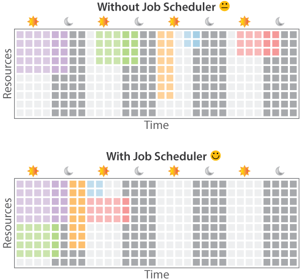

---
**Qup:** (queue-up) A single-node job scheduler with NVIDIA GPU support
---

# Introduction
Qup is a simple, no-fuss single-node job scheduler, similar to slurm, sun grid engine, or pbs.  The primary features are:
- Out of the box, it keeps track of available CPU cores, memory, and GPU resources using a simple FIFO scheduler.
- It includes support for scheduling NVIDIA GPUs running CUDA (throught the CUDA_VISIBLE_DEVICES environment parameter)
- It's intended for single machines (i.e. your workstation, or your lab's server)
- It's intended to be setup and running in under two minutes. 
- It can parse a stripped-down subset of PBS scripts, making it somewhat compatible with slurm, SGE, or PBS.

Qup is written in Scala 2.11 and requires Java 1.8+.  It has been tested on Ubuntu 20.04 LTS, and is intended for Ubuntu (or systemd-based) installations.

### Why use a job scheduler?


A typical way of running many jobs is to run each one manually, wait until they're finished, notice this, and then run the next job in the sequence.  This is very slow, causes lots of unused cycles between when a job finishes and when you run your next job, and (in multi-user settings) can cause jobs to conflict if they consume more than the available resources.

A better way is to use a job scheduler, which allows you to queue up a long list of jobs to run as the resources (cpucores, memory, gpus) come available, either on your own workstation, or your lab's server.

### Why another job scheduler?
Slurm, Sun Grid Engine (SGE), and PBS are existing job schedulers that scale to large high-performance clusters.  Some of them (and their open source counterparts) are becoming infrequently maintained, making installation on modern Ubuntu distributions difficult.  Slurm is actively maintained, but can be challenging to install (and, is primarily intended for large HPCs).  Qup offers a simple single-system alternative, with similar looking tools and scripts (e.g. *qsub, qstat, qdel, etc*).

# Installation
Assuming Java 1.8+ is installed on your Ubuntu distribution, installation is fast, taking only a few moments.  Note that you should not install Qup if you already have slurm, SGE, or PBS installed, as it may overwrite some of your commands (*qsub, qstat, qdel, etc*): 

Clone the repository:
```
git clone https://www.github.com/clulab/qup.git
```

Run the installation script as root:
```
cd qup
sudo ./install.sh
```

Start the Qup service:
```
sudo systemctl start qup.service
```

# Getting Started -- Submitting your first job

The distribution includes a sample PBS script that runs *stress* (a high-CPU load stress tester) for 1 minute.  Here's how to submit it:

First, add yourself as an administrative user:
```
sudo qadduser <yourusername> 1
```

Also, install *stress*, for the sample stress-test job:
```
sudo apt-get install stress
```

Then, submit the sample job:
```
qsub pbs-examples/example-1min.pbs
```

This should produce a verbose submission message, that looks something like this:
```
            Job ID:  1
             Status:  queued
          Exit Code:  -
           Priority:  1
        Preemptable:  false
           Username:  peter
           Job Name:  example_test_name
       Project Code:  example_project_name
       Working path:  /home/peter/github/qup1/qup
    Filename to run:  pbs-examples/example-1min.pbs
Resources requested:  cpucore: 4     gpu: 2     memory: 2
Resources allocated:  
    Output (stdout):  /home/peter/github/qup/job.1.stdout.txt
    Output (stderr):  /home/peter/github/qup/job.1.stderr.txt
    Submission Time:  2021-02-02 17:08:20
         Start Time:  
        Finish Time:  
 Time waited to run:  00d-00:00:00 so far
      Total runtime:  has not run yet.
    Wall Time Limit:  01d-00:00:00 (24.000 hours)
Notes: none 

Submitted job 1
```

You can then monitor the status of your job using **qstat**:
```
qstat
```

This should show the queue (as well as the last few completed jobs), as shown below.  The job status (first column) will be either **q** (queued), **r** (running), or **c** (completed).  In the example below, the job has already completed, with an exit code of 0 (success), and a total runtime of 00d-00:01:00 (1 minute):
```
Current Queue (0 jobs)
Available Resources: cpucore: 32/32  memory: 500/500  gpu: 4/4
ST  EC   PR  JOBID   USERNAME             PATH                           RUNSCRIPT                      RESOURCES                                          TIME                                                                   
------------------------------------------------------------------------------------------------------------------------------------------------------------------------------------------------
c   0    1   1       peter                /home/peter/github/qup         pbs-examples/example-1min.pbs  cpucore: 4     gpu: 2     memory: 2                Ended: 2021-02-02 17:09:21 (Runtime: 00d-00:01:00)                     
```

The output of the job can be viewed using:
```
cat job.1.stdout.txt
cat job.1.stderr.txt
```

# Qup Server Configuration
The Qup configuration file is located at */etc/qup/configuration.properties*. 

### Configuring Resources
Most users will need only modify the *resources* section to match the number of cpu cores, memory, and GPUs available on their system.  The default configuration has 32 cores, 500GB of RAM, and four NVIDIA GPU devices (0, 1, 2, 3):

```
#
#   Resources
#

# Maximum number of CPU cores available
resource.continuous.cpucore = 32

# Maximum amount of memory available (in gigabytes)
resource.continuous.memory = 500

# Names of GPUs available (from NVIDIA-SMI)
resource.discrete.gpu = 0, 1, 2, 3

# If enabled (true), randomly (rather than sequentially) assigns discrete resources (like GPUs)
resource.shuffleDiscreteResources = false
```

Note that GPUs must be enumerated using the same names that will be used for setting the *CUDA_VISIBLE_DEVICES* environment variable.  Typically this is 0, 1, 2, ... . 

### Other Configuration
The configuration file contains a number of other options that are unlikely to be required by most users (server port, modifying standard paths, etc).  HPCs typically isolate worker nodes behind a private network -- you may also wish to close the qup server port (default 9000) to outside traffic by modifying your firewall settings. 


# User Commands and Tools
Administrative (run as root):
- **qadduser:** Add a user to the Qup scheduler
- **qremoveuser:** Remove a user's access to the Qup scheduler

Job Scheduling:
- **qsub:** Submit a job
- **qdel:** Delete a job (whether queued, or kill a currently running job)
- **qinfo:** Show detailed information about a job
- **qstat:** Show all currently queued, running, and recently completed jobs

Statistics:
- **qusage:** Show usage statistics for all users
- **qshowusers:** Show users with access to the Qup scheduler


# PBS Scripts
Jobs are submitted using **qsub**, and referencing a specific PBS script.  Qup supports a limited subset of PBS commands, as illustrated in the following example PBS file, which can be used as a template for running your jobs:
```
#!/bin/bash
### Job Name
#PBS -N example_test_name
### Project code
#PBS -A example_project_name
### Maximum time this job can run before being killed (here, 1 day)
#PBS -l walltime=01:00:00:00
### Resource Request (must contain cpucore, memory, and gpu (even if requested amount is zero)
#PBS -l cpucore=4:memory=2gb:gpu=2
### Output Options (default is stdout_and_stderr)
#PBS -l outputMode=stdout_and_stderr
##PBS -l outputMode=no_output
##PBS -l outputMode=stdout_only
##PBS -l outputMode=stderr_only


### Run your job here
printenv
nvidia-smi
stress --cpu 1 -t 60
```

### Supported PBS commands
- Job name (using #PBS -N &lt;jobName>))
- Project name (using #PBS -A &lt;projectName>))
- Wall time limit (using #PBS -l walltime=&lt;DD:HH:MM:SS>).  If a job is still running past this time, it will be killed.
- Output mode (using #PBS -l outputMode=&lt;outputMode>).  Defines whether the stdout and stderr output of a job will be saved.  Defaults to saving both.  Possible values are (stdout_and_stderr, no_output, stdout_only, stderr_only).
- Resource allocation request (using #PBS -l cpucore=4:memory=2gb:gpu=2).  cpucore in number of cores, memory in xGB, and GPUs in number of GPUs (e.g. 3 not 0,1,2). 

Other commands (e.g. mailing when completed) are not currently supported. 

# Scheduler 

The scheduler is implemented as FIFO (first-in, first out) scheduler with priority queueing.  Jobs are submitted with an optional priority (an integer between 1 (highest) and 9 (lowest)), and higher priority jobs are executed first.  The **adduser** command allows specifying the users maximum priority level, essentially allowing certain users to have high priority, normal priority, or low-priority access to the queue.

# Frequently Asked Questions (FAQ)
**Q: How do I submit jobs?**

A: Write a PBS run script (use the template above for a quick start), and submit it using **qsub**.  It will automatically execute in the next available spot.  Use **qstat** or **qinfo** to monitor it's progress. 

**Q: Where does the console output of the job go?**

A: The output (stdout, stderr) is redirected to files using the filename "job.&lt;jobid>.stdout/stderr.txt".  They are placed in the directory that the qsub job was submitted from.  The location of these logs can be shown using **qinfo &lt;jobid>**.  Logs can be turned off (or enabled only for stdout or stderr) using the *outputMode* setting in the PBS script.  4 modes are supported (stdout_and_stderr (default), no_output, stdout_only, stderr_only).  See the example PBS script for example usage. 

**Q: How can I see how busy the system currently is?**

A: **qstat** displays the proportion of resources (cpucores, memory, gpus) currently allocated at the top, as well as the number of queued and running jobs.

**Q: How can I see usage statistics for the users/machine?**

A: High-level usage statistics for all users (number of jobs submitted, resource hours requested, etc) can be shown using **qusage**. 

**Q: Using qsub returns an authentication error?**

A: Each user must be added to Qup by someone with sudo access, using the **qadduser** command, before they can submit to the queue.  A list of all authenticated users for qup is available using **qshowusers**. 

**Q: Using any of the user tools (qsub, etc) gives a connection error?**

A: Check that the qup service is running through systemd:
`sudo systemctl status qup.service`

**Q: How does authentication work between the user and Qup?**

A: When a user is added, a password key is randomly generated.  A copy is stored in the user's home directory (with read permissions only for that user), and in the qup server directory (with read permissions only for root).  When specific requests are made (e.g. qsub, qdel), the user sends their password in the request packet, and it's verified by the server before completing the request.

**Q: Is there a log file for server usage/errors?**

A: Typically in */var/log/qup/outputLog.txt*.  This is set in qup.sh .

**Q: Do jobs run in a virtual machine, container, or other box?**

A: No.  If you want to run in a VM, container, or other box, you will need to do this in the runscript.  As is typical in non-VM schedulers, this means jobs must be well-behaved -- a job that requests 2 CPU cores could use 10, so it's up to the user to be accurate in their requests or jobs can conflict.  When in doubt, it's generally best to err on the side of caution and over request.

**Q: How do GPU requests work with CUDA?**

A: The cannonical way for CUDA jobs to run concurrently without conflict is for each job to check the *CUDA_VISIBLE_DEVICES* environment variable, and only use the GPUs enumerated in this variable.  Qup sets this environment variable for any devices that request GPU resources (and, empties it for jobs that do not request GPUs).  If a given piece of software does not check or respect *CUDA_VISIBLE_DEVICES*, then you should request all GPU resources on the machine to avoid conflicts.  For example, if a job requires 1 GPU on a 4 GPU machine, but the software does not respect *CUDA_VISIBLE_DEVICES* and decides on it's own which GPU to use, then that job is not well behaved.  It can still be run safely by requesting all 4 GPUs on the machine, to ensure no other GPU jobs run along side it.

**Q: Does the scheduler support backfilling?**

A: Time hints for backfilling are partially implemented in the storage classes, but it hasn't been implemented in the scheduler yet. 

**Q: Does the scheduler support preemtable jobs?**

A: Pre-emptable (background) jobs are partially implemented in the storage classes, but haven't been implemented in the scheduler yet.

**Q: Does qup support interactive jobs?**

A: No, given that the jobs are not run in a VM, and the user has direct access to the machine, interactive job support is not implemented.

# Contact
Qup was written by Peter Jansen (pajansen@email.arizona.edu).  For questions, issues, bug reports, or feature requests, please start a github issue. 

